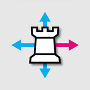

# Chess Puzzles

Hundreds of chess puzzles are now at your fingertips with Chess Puzzles.

**[Play Chess Puzzles — free](https://adrian3.github.io/chess-puzzles/)**

Find the hidden checkmate, spot a surprising sacrifice, and sharpen your eye for the winning move. With **367 puzzles**, from mate-in-one to longer combinations, there is always another position to untangle.

## Find the winning move

- **A challenge for every mood.** Filter by mate length, side to move, and puzzles you have or have not solved.
- **Help when you need it.** Get feedback on your moves and a hint after three wrong attempts.
- **Make your progress visible.** Track solved puzzles, perfect solutions, accuracy, hints, and streaks.
- **Work your way up.** Unlock puzzles in sets of 50 and advance your rank from pawn to king.

Open a puzzle, tap a piece, then tap its destination. Keep going until you find checkmate.

The opening sentence is adapted from the [original Chess Puzzles Pro iOS description](https://rawg.io/games/chess-puzzles-pro).

## From the App Store to the web

The original iOS editions, Free Chess Puzzles and Chess Puzzles Pro, reached **75,687 downloads combined**. This free web edition brings that puzzle experience back to your browser.

## Keep it on your home screen

These are progressive web apps (PWAs): open the link above to play, or install the app from your browser for quick access with its own icon.

**iPhone or iPad**
1. Open the app in **Safari**.
2. Tap **Share** (you may need to open the **Page Menu** first), then **Add to Home Screen**.
3. Turn on **Open as Web App** if that option appears, then tap **Add**.
4. Launch it from your home screen.

**Android**
1. Open the app in **Chrome**.
2. Tap **⋮** → **Add to home screen** → **Install** (or **Install app**, depending on your browser).
3. Follow the prompts, then launch it from your home screen or app drawer.

Need help? See [Apple’s home screen instructions](https://support.apple.com/guide/iphone/open-as-web-app-iphea86e5236/ios) or [Chrome’s installation guide](https://support.google.com/chrome/answer/9658361?co=GENIE.Platform%3DAndroid&hl=en).

## Four ways to enjoy chess

Originally released for iOS, this family of chess apps is now available **free as PWAs** on phones, tablets, and computers.

| App | Find your next challenge |
| --- | --- |
| [Chess Puzzles](https://adrian3.github.io/chess-puzzles/) | Find the checkmate in 367 puzzles. |
| [Eugene Chess](https://adrian3.github.io/eugene-chess/) | Play against the computer at your own pace. |
| [Chess Server](https://adrian3.github.io/chess-server/) | Play live opponents and watch games on FICS. |
| [Grandmaster Archive](https://adrian3.github.io/grandmaster-archive/) | Replay classic games and learn from the greats. |

Designed and developed by **[Ade Hanft](https://adrian3.com)**.
